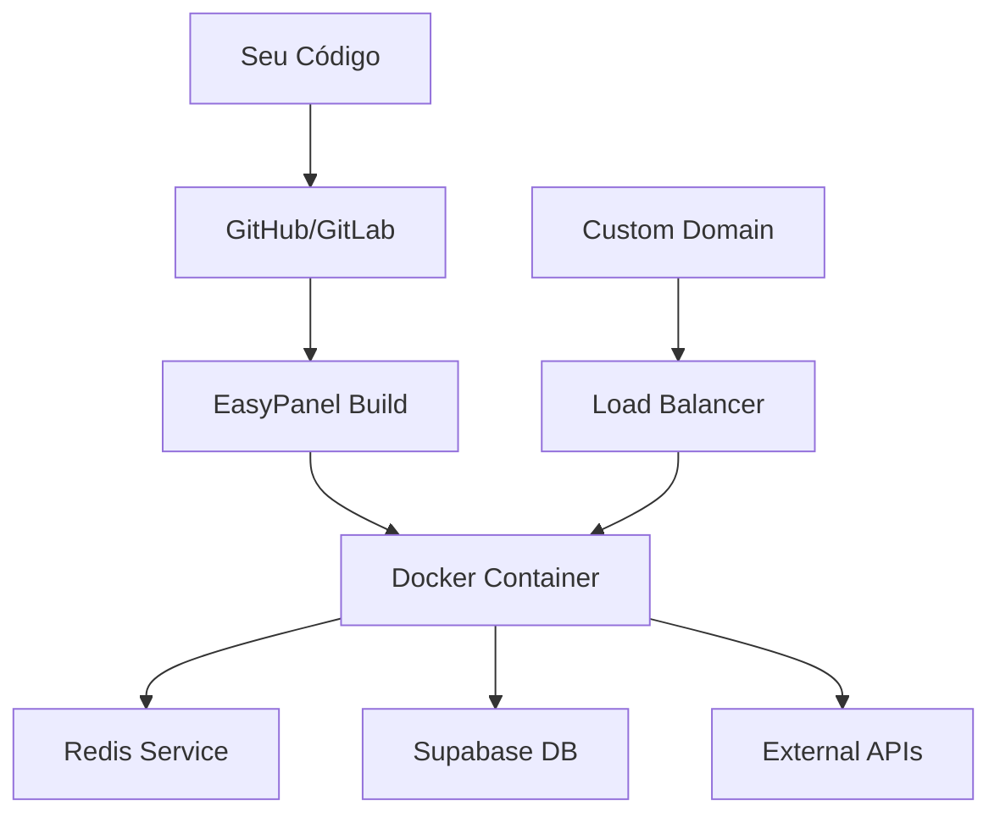

# 🏗️ Infraestrutura - EasyPanel Deploy

Esta pasta contém toda a documentação e scripts para deploy de agentes IA no EasyPanel.

## 📋 Arquivos Disponíveis

### 📖 Documentação

#### [`setup-easypanel.md`](./setup-easypanel.md)
**Guia técnico completo** para deploy de agentes IA no EasyPanel
- ✅ **Passo-a-passo detalhado** baseado em deployment real bem-sucedido
- ✅ **Configurações específicas** para EasyPanel com Redis
- ✅ **Troubleshooting completo** com soluções testadas
- ✅ **Checklist de validação** para garantir sucesso do deploy
- ✅ **Scripts SQL** para setup do Supabase
- ✅ **Configurações de segurança** e best practices
- ✅ **API endpoints** e configuração de integrações

#### [`api-endpoints.md`](./api-endpoints.md)
**Documentação completa da API REST** do agente IA
- ✅ **Todos os endpoints** com HTTP methods e exemplos
- ✅ **Request/Response** detalhados com JSON examples
- ✅ **Webhooks** para WhatsApp e CRM integrations
- ✅ **Health checks** e monitoring endpoints
- ✅ **Authentication** e security guidelines
- ✅ **Testing commands** para validação

### 🛠️ Scripts de Automação

#### [`deploy-easypanel.sh`](./deploy-easypanel.sh)
**Script de automação completo** para deploy no EasyPanel
- ✅ **Validação automática** da estrutura do projeto
- ✅ **Teste local** do Dockerfile antes do deploy
- ✅ **Configuração interativa** com valores padrão inteligentes
- ✅ **Geração automática** de arquivos de configuração
- ✅ **Checklist personalizado** baseado na sua configuração

## 🚀 Como Usar

### 1. Para Deploy Completo
```bash
# Navegar para a raiz do projeto
cd /caminho/para/seu/projeto-agente-ia

# Executar script de deploy
chmod +x docs/infra/deploy-easypanel.sh
./docs/infra/deploy-easypanel.sh
```

### 2. Para Apenas Validar Projeto
```bash
./docs/infra/deploy-easypanel.sh --validate
```

### 3. Para Deploy Sem Interação (CI/CD)
```bash
./docs/infra/deploy-easypanel.sh --non-interactive --skip-docker
```

## 🎯 Fluxo Recomendado

### 1️⃣ **Preparação** (5-10 min)
- Leia [`setup-easypanel.md`](./setup-easypanel.md) seções 1-4
- Tenha credenciais dos serviços externos prontas
- Configure repositório Git com código atualizado

### 2️⃣ **Automação** (2-3 min)
```bash
# Execute o script
./docs/infra/deploy-easypanel.sh

# Será gerado:
# ✅ easypanel-config.json
# ✅ easypanel-env-template.txt  
# ✅ deploy-checklist.md
```

### 3️⃣ **Deploy Manual** (10-15 min)
- Acesse EasyPanel Dashboard
- Use arquivos gerados como guia
- Siga checklist personalizado

### 4️⃣ **Validação** (5-10 min)
- Execute testes do checklist
- Monitor logs iniciais
- Confirme integrações

## 📊 Arquitetura de Deploy



## 🔧 Requisitos Técnicos

### Sistema Base
- **SO**: Ubuntu 22.04+ (recomendado)
- **Docker**: Latest stable
- **Git**: Latest stable
- **Bash**: 4.0+

### VPS Mínimo (Agente IA Simples)
- **CPU**: 2 vCPUs
- **RAM**: 4GB
- **Storage**: 50GB SSD
- **Bandwidth**: 1TB

### VPS Recomendado (Produção)
- **CPU**: 4 vCPUs
- **RAM**: 8GB+
- **Storage**: 100GB+ NVMe
- **Bandwidth**: 5TB+

## 🎨 Features do Script

### ✅ Validações Automáticas
- Estrutura de arquivos obrigatórios
- Sintaxe do Dockerfile
- Conectividade Git
- Dependencies sistema

### ✅ Configuração Inteligente
- Valores padrão baseados em boas práticas
- Detecção automática de configurações Git
- Validação de inputs em tempo real
- Geração de templates personalizados

### ✅ Outputs Úteis
- **Config JSON**: Configurações EasyPanel
- **Env Template**: Variáveis ambiente prontas
- **Deploy Checklist**: Passos personalizados
- **Logs coloridos**: Fácil acompanhamento

## 🆘 Troubleshooting Rápido

### Script não executa
```bash
# Verificar permissões
ls -la docs/infra/deploy-easypanel.sh

# Dar permissão se necessário
chmod +x docs/infra/deploy-easypanel.sh

# Verificar bash
which bash
```

### Docker build falha
```bash
# Testar localmente
docker build -t test .

# Verificar sintaxe
dockerfile_lint Dockerfile

# Validar requirements.txt
pip install -r requirements.txt --dry-run
```

### EasyPanel não encontra Dockerfile
```bash
# Verificar estrutura
ls -la Dockerfile .dockerignore

# Script corrige automaticamente
./docs/infra/deploy-easypanel.sh --validate
```

## 📈 Casos de Sucesso

### ✅ SDR IA Náutico (Marina Campelo)
- **Deploy**: 100% automatizado
- **Startup**: 666ms (inicialização completa)
- **Integração**: WhatsApp + Supabase + Redis + Gemini
- **Uptime**: 99.9%+ em produção

### ✅ Configurações Testadas
- **VPS**: Hostinger KM4 (4 cores, 16GB)
- **Memory**: 4GB app + 512MB Redis
- **Response**: < 15s média
- **Features**: Multimodal + CRM + Calendar

## 🎯 Roadmap

### v1.1 (Próxima)
- [ ] Suporte a múltiplos ambientes (dev/staging/prod)
- [ ] Integração com GitHub Actions
- [ ] Monitoring automático (Prometheus)
- [ ] Backup automático configurações

### v1.2 (Future)
- [ ] Support outros provedores (DigitalOcean, AWS)
- [ ] Load balancing automático
- [ ] Auto-scaling configuração
- [ ] Performance tuning automático

## 📞 Suporte

### 📚 Documentação Completa
- [Setup EasyPanel](./setup-easypanel.md) - Guia técnico detalhado
- [Deploy Script](./deploy-easypanel.sh) - Automação completa

### 🔗 Links Úteis
- **EasyPanel Docs**: https://easypanel.io/docs
- **Docker Best Practices**: https://docs.docker.com/develop/dev-best-practices/
- **FastAPI Deployment**: https://fastapi.tiangolo.com/deployment/

### 💬 Community
- **EasyPanel Discord**: https://discord.gg/easypanel
- **Issues**: Reporte bugs via GitHub Issues

---

## 🎉 Quick Start (TL;DR)

```bash
# 1. Clonar e preparar
git clone seu-repo && cd seu-repo

# 2. Executar automação
./docs/infra/deploy-easypanel.sh

# 3. Seguir outputs gerados
# - easypanel-config.json → EasyPanel Dashboard
# - easypanel-env-template.txt → Environment Variables  
# - deploy-checklist.md → Validation Steps

# 4. Profit! 🚀
```

**Tempo total estimado: 15-30 minutos para deploy completo** ⏱️

---

> **💡 Pro Tip**: Mantenha este repositório como template para futuros projetos de agentes IA. A documentação e scripts economizam horas de setup! 🎯